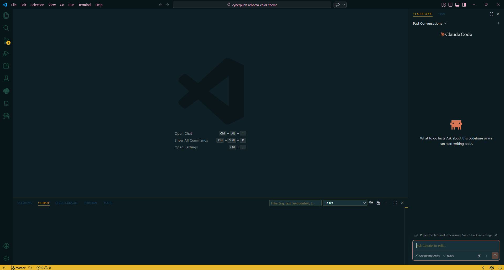
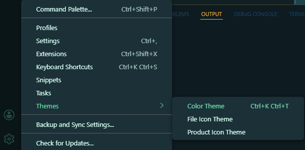
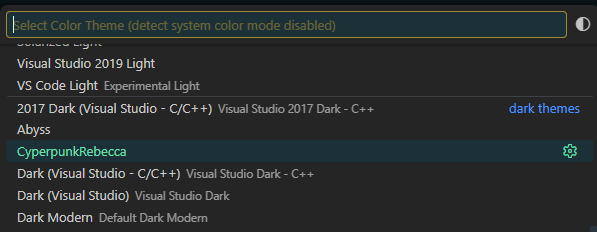

# Cyberpunk Rebecca Color Theme

A VS Code color theme inspired by the character Rebecca from Cyberpunk: Edgerunners.

## Preview

## How to Use

1. Click on the **Settings** icon (⚙️) in VS Code.
2. Hover your cursor over **Themes**, then select **Color Theme**.

   

3. Select **CyperpunkRebecca** from the list of themes.

   

## Disclaimer

This extension is a fan project and is not affiliated with CD Projekt Red or Studio Trigger.

**Enjoy!**
